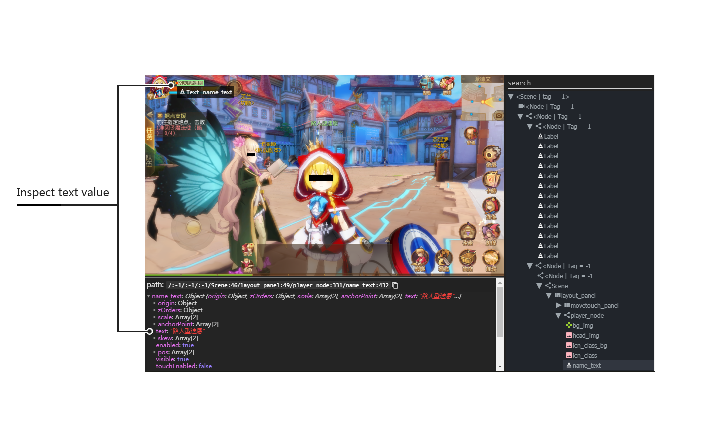
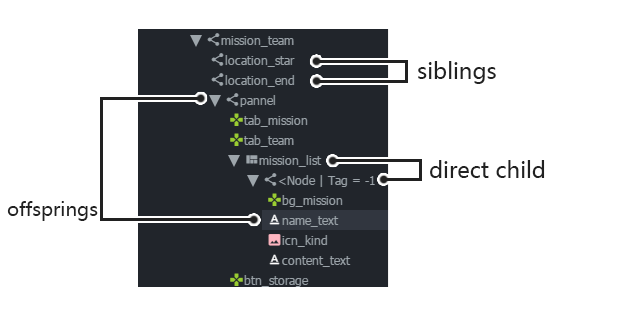
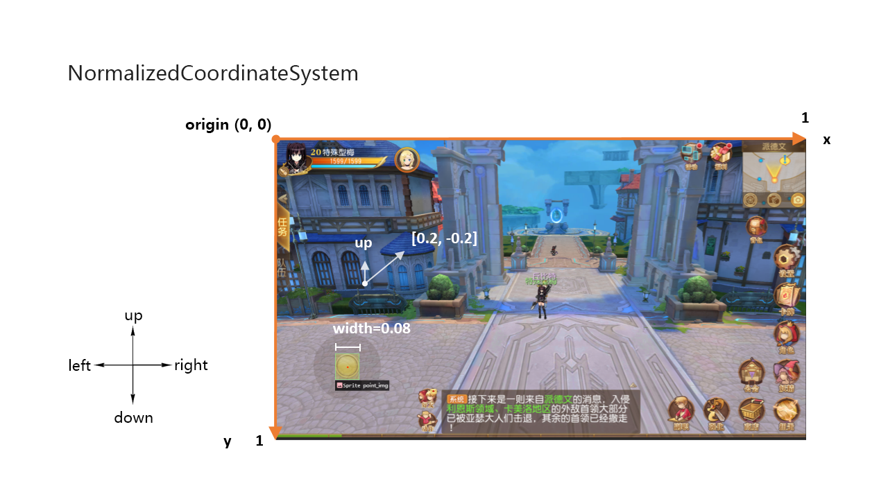
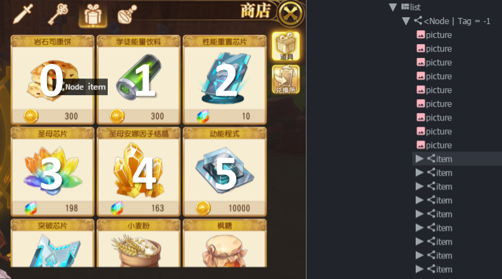
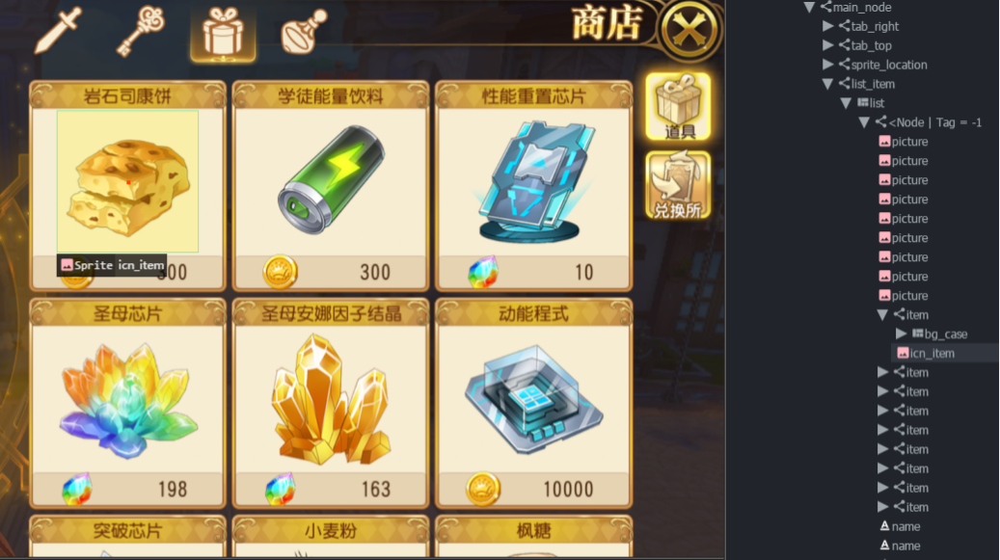

# Poco ポコ

**A cross-engine UI automation framework**

[English README](README.md) here.

<!-- chinese only -->

一个引擎无关的自动化框架。通过HunterRpc进行数据传输，所有接入了[hunter](http://hunter.nie.netease.com)的项目可直接使用该测试框架。

## 提醒(notice)

UI自动化有风险，请务必等待UI freeze阶段后再投入生产和使用。

<!-- end of chinese only -->

## 安装(installation)

```sh
# airtest runtime
git clone ssh://git@git-qa.gz.netease.com:32200/gzliuxin/airtest.git
pip install -e airtest

# aircv for airtest
git clone -b open-source ssh://git@git-qa.gz.netease.com:32200/airtest-projects/aircv.git
pip install -e aircv

# hrpc
git clone ssh://git@git-qa.gz.netease.com:32200/maki/hrpc.git
pip install -e hrpc

# hunter-cli
git clone ssh://git@git-qa.gz.netease.com:32200/maki/hunter-cli.git
pip install -e hunter-cli

# hunter lib for airtest
git clone ssh://git@git-qa.gz.netease.com:32200/maki/airtest-hunter.git
pip install -e airtest-hunter

# poco
git clone ssh://git@git-qa.gz.netease.com:32200/maki/poco.git
pip install -e poco

# poco unittest framework
git clone ssh://git@git-qa.gz.netease.com:32200/maki/PocoUnit.git
pip install -e PocoUnit
```

<!-- chinese only -->

安装遇到权限问题请下载我们的[deploy-key](http://init.nie.netease.com/downloads/deploy/deploy-key)，将下载下来的deploy-key放到 `C:\User\<username>\.ssh\` 目录下，改名为`id_rsa`，再重新运行上面的命令。

<!-- end of chinese only -->

## 基本概念(concepts)

<!-- chinese only -->

### 测试

**TestCase**: 无论以何种形式表示的测试内容的一个单元，以下均指使用Poco编写的测试脚本  
**TestSuite**: 多个TestCase或TestSuite构成的一系列脚本文件  
**TestRunner**: 用于启动测试的一个东西，可能是一个可执行文件也可以是一个class。Poco默认使用Airtest作为TestRunner，使用Airtest启动的测试需要安装Airtest环境  
**TestTarget/TargetDevice**: 运行待测应用程序的设备，以下均指运行在手机上的待测游戏或PC版待测游戏  

**TestFramework**:  测试框架，Poco就是一个测试框架  
**TestFrameworkSDK**:  测试框架与待测应用集成的模块，一般来说不是必须的，Poco里带有一个SDK  

<!-- end of chinese only -->

### Poco测试框架相关

**目标设备**: 待测应用或游戏运行的机器，一般指手机  
**UI代理(UI proxy)**: poco框架内代表游戏内0个1个或多个UI元素的代理对象  
**节点/UI元素(Node/UI element)**: 应用/游戏内UI元素的实例，就是平时所说的UI  
**选择器(选择表达式)(query condition/expression)**: 一个可序列化的数据结构，poco通过该表达式与**目标设备**交互并选出其代表的对应的UI元素。Tester一般不用关心这个表达式的内部结构，除非要自定义`Selector`类。  





### 坐标系与度量空间定义



#### 归一化坐标系

归一化坐标系就是将屏幕宽和高按照单位一来算，这样UI在poco中的宽和高其实就是相对于屏幕的百分比大小了，好处就是不同分辨率设备之间，同一个UI的归一化坐标系下的位置和尺寸是一样的，有助于编写跨设备测试用例。

归一化坐标系的空间是均匀的，屏幕正中央一定是(0.5, 0.5)，其他标量和向量的计算方法同欧式空间。

#### 局部坐标系（局部定位）

引入局部坐标系是为了表示相对于某UI的坐标。局部坐标系以UI包围盒左上角为原点，向右为x轴，向下为y轴，包围盒宽和高均为单位一。其余的定义和归一化坐标系类似。

局部坐标系可以更灵活地定位UI内或外的位置，例如(0.5, 0.5)就代表UI的正中央，超过1或小于0的坐标值则表示UI的外面。

## 对象选择与操作

### 选择器实例初始化

不用引擎版本的poco的实例化方式有点不一样，以下以Unity3D为例，其余的请参考：

* [cocos2dx-js]()
* [android-native]()
* unreal (开发中)
* (others see [INTEGRATION guide]() for more details)
<!-- chinese only -->
* [NetEase Internal Engines]() 公司内所有引擎请点此链接
<!-- end of chinese only -->

```python
from poco.vendor.unity3d import UnityPoco

poco = UnityPoco()
ui = poco('...')
```

### 基本选择器

`poco`对象的`__call__`方法就是进行选择，遍历整个渲染树形结构，选出所有满足给定的属性的对象代理。第一个参数为节点名，其余的属性键值对通过命名参数传入。具体可参考API Reference。

```python
# 根据节点名选择
poco('bg_mission')

# 节点名和属性选择
poco('bg_mission', type='Button')
poco(textMatches='^据点.*$', type='Button', enable=True)
```


### 相对选择器

直接通过节点名或节点类型选择的对象容易产生歧义或无法选择时，可通过相对的方式按层级进行选择

```python
# 直系孩子/后代选择
poco('main_node').child('list_item').offspring('item')
```
``


### 顺序选择器（索引选择器，更推荐迭代遍历）

索引和遍历会默认按照从左到右从上到下的空间顺序按顺序遍历。遍历过程中，还未遍历到的节点如果从画面中移除了则会抛出异常，已遍历的节点即使移除也不受影响。遍历顺序在遍历开始前已经确定，遍历过程中界面上的节点进行了重排则仍然按照之前的顺序进行遍历。

```python
items = poco('main_node').child('list_item').offspring('item')
print(items[0].child('material_name').get_text())
print(items[1].child('material_name').get_text())
```



### 遍历对象集合

```python
# 遍历每一个商品
items = poco('main_node').child('list_item').offspring('item')
for item in items:
    item.child('icn_item')
```



### 获取对象代理属性

```python
mission_btn = poco('bg_mission')
print(mission_btn.attr('type'))  # 'Button'
print(mission_btn.get_text())  # '据点支援'
print(mission_btn.attr('text'))  # '据点支援'，与get_text方法等价
print(mission_btn.exists())  # True，表示是否存在界面中
```

### 对象代理操作

#### click

点击对象，默认以锚点(挂接点)(anchorPoint)对象为点击点。第一个参数传入点击相对位置，对象包围盒左上角为`[0, 0]`，右下角为`[1, 1]`。偏移范围可以比0小也可以比1大，超过0~1的范围表示超出包围盒范围。

```python
poco('bg_mission').click()
poco('bg_mission').click('center')
poco('bg_mission').click([0.5, 0.5])    # 等价于center
poco('bg_mission').focus([0.5, 0.5]).click()  # 等价于上面的表达式
```


#### swipe

以对象anchor为起点，朝某个方向滑动一段距离

```python
joystick = poco('movetouch_panel').child('point_img')
joystick.swipe('up')
joystick.swipe([0.2, -0.2])  # 向右上方45度滑动sqrt(0.08)单位距离
joystick.swipe([0.2, -0.2], duration=0.5)
```


#### drag
 
从当前对象拖拽到目标对象

```python
poco(text='突破芯片').drag_to(poco(text='岩石司康饼'))
```


#### focus (局部定位)

与节点坐标相关的操作默认以anchor为起始点，click的话就直接click在anchor上。如果要进行局部的点击偏移，可以使用focus操作。focus同屏幕坐标系类似，以节点包围盒左上角为原点，长宽均为1，中心点即为`[0.5, 0.5]`，右下角为`[1, 1]`，以此类推。

```python
poco('bg_mission').focus('center').click()  # 点击中心点
```


focus也可以用于一个对象的内部定位，例如实现一个ScrollView的卷动操作

```
scrollView = poco(type='ScollView')
scrollView.focus([0.5, 0.8]).drag_to(scrollView.focus([0.5, 0.2]))
```

#### wait
等待目标对象出现，总是返回对象自身，如果出现立即返回，否则timeout后返回
```python
poco('bg_mission').wait(5).click()  # 最多等待5秒，出现即点击
poco('bg_mission').wait(5).exists()  # 最多等待5秒，返回是否exists
```

## 捕获异常

```python
from poco.exceptions import PocoTargetTimeout

try:
    poco('guide_panel', type='ImageView').wait_for_appearance()
except PocoTargetTimeout:
    # 面板没有弹出来，有bug
    raise
```

```python
from poco.exceptions import PocoNoSuchNodeException

img = poco('guide_panel', type='ImageView')
try:
    if not img.exists():
        img.click()
except PocoNoSuchNodeException:
    # 尝试对不存在的节点进行操作，会抛出此异常
    pass
```

# 单元测试

poco是自动化框架，关于单元测试请见[PocoUnit](http://git-qa.gz.netease.com/maki/PocoUnit)。PocoUnit提供了一整套完整的断言方法，并且和python标准库unittest是兼容的。


<!-- chinese only -->

## 接入参考

1. safaia版本需要高于1.2.0，如果不高于的话项目组master可在[项目](http://hunter.nie.netease.com/mywork/project#/)页直接下载最新版的接入模块。
1. 在项目的`__init__`指令后面插入以下代码片段，然后重启游戏即可，以下是NeoX引擎的例子，其余引擎的sdk正在更新中，敬请期待。

```python
# poco uiautomation
PocoUiautomation = require('support.poco.neox.uiautomation')
Safaia().install(PocoUiautomation)

# inspector extension
InspectorExt = require('support.poco.safaia.inspector')
InspectorExt.screen = require('support.poco.neox.screen')()
InspectorExt.dumper = require('support.poco.neox.Dumper')()
Safaia().install(InspectorExt)
```

3. [hunter终端](http://hunter.nie.netease.com) 右上角点击**Inspector**按钮打开检视器面板。

<!-- end of chinese only -->
