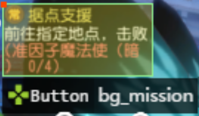
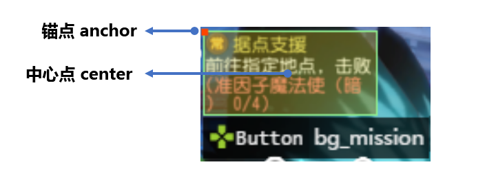

# Poco ポコ

**A cross-engine UI automation framework**

[中文README(Chinese README)](README-CN.md)在此。

## Installation

```sh
pip install poco
```

## Features

* Support mainstream game engines, like Unity3D, cocos2dx-js, cocos2dx-lua, Android native, etc.
* Super fast and impact-less to the game.
* Very easy to integrate sdk in the game.
* Simple powerful APIs across all engines.
* Support multi-touch (fling/pinch/etc.).
* Support gps, gyros, rotation (landscape/portrait) and other sensors as input.
* Support retrieve UI properties and send text as input.
* Customizable by [poco-sdk]().
* Alternative rpc interface.
* No extra dependencies.
* Compatible with Python 2.7 and Python 3.3+.

## Example

The following example shows a simple test script on demo game using Unity3D. More examples [here]().

```python
from poco.drivers.unity3d import UnityPoco as Poco

poco = Poco(('localhost', 5001))

# tap start button
poco('start_btn', type='Button').click()

# collect all 'stars' to my 'bag' by dragging the star icon
bag = poco('bag_area')
for star in poco(type='MPanel').child('star'):
    star.drag_to(bag)

# click Text starting with 'finish' to finish collecting
poco(textMatches='finish.*').click()
```

## Basic Concepts

* **Target device**: test devices apps or games will run on, usually refers to mobile phones
* **UI proxy**: proxy objects within poco framework, representing 0, 1 or multiple in-game UI elements
* **Node/UI element**: UI element instances within apps/games, namely UI
* **query expression**: a serializable data structure through which poco interacts with **target devices** and selects the corresponding UI elements. Tester usually don't need to pay attention to the internal structure of this expression unless they need to customize the `Selector` class.


### Definitions of coordinate system and metric space


#### Normalized Coordinate System

In normalized coordinate system, the height and width of the screen are measured in the range of 1 unit and these two parameters of UI within poco correspond to certain percentage of the screen size. Hence the same UI on devices with different resolution will have same position and size within normalized coordinate system, which is very helpful to write cross-device test cases.

The space of normalized coordinate system is well distributed. By all means, the coordinate of the screen center is (0.5, 0.5) and the computing method of other scalars and vectors are the same as that of Euclidean space.

#### Local Coordinate System (local positioning)

The aim of introducing local coordinate system is to express coordinates with reference to a certain UI. Local coordinate system  takes the top left corner  of UI bounding box as origin, the horizontal rightward as x-axis and the vertical downward as y-axis, with the height and width of the bounding box being 1 unit  and other definitions being similar with normalized  coordinate system.

Local coordinate system is more flexible to be used to locate the position within or out of UI. For instance, the coordinate (0.5, 0.5)corresponds to the center of the UI while coordinates larger than 1 or less than 0 correspond to the position out of the UI.


## Poco Instance

For different engines, please initialize different `poco` instance. This part will take Unity3D as an example. For other engines, please refer to:

* [cocos2dx-js]()
* [android-native]()
* unreal (in development)
* (others see [INTEGRATION guide]() for more details)


```python
from poco.vendor.unity3d import UnityPoco

poco = UnityPoco()
ui = poco('...')
```

## Object Selection and Operation

### Basic Selector

The invocation `poco(...)` instance is to traverse through the render tree structure and select all the UI elements matching given query expression. The first argument is node name and other key word arguments are correspond to other properties of node. For more information, please refer to API Reference.

```python
# select by node name
poco('bg_mission')

# select by name and other properties
poco('bg_mission', type='Button')
poco(textMatches='^据点.*$', type='Button', enable=True)
```




### Relative Selector

When there is an ambiguity in the objects selected by node names/node types or failing to select objects, try selecting by hierarchy in a corresponding manner

```python
# select by direct child/offspring
poco('main_node').child('list_item').offspring('item')
```


### Sequence Selector (index selector, iterator is more recommended for use)

Index and traversal will be performed in default up-down or left-right space orders. If the not-yet-traversed nodes are removed from the screen, an exception will be thrown whereas this is not the case for traversed nodes that are removed. As the traversal order has been determined before in advance, the traversal will be performed in a previous order even though the nodes in views are rearranged during the traversal process.

```python
items = poco('main_node').child('list_item').offspring('item')
print(items[0].child('material_name').get_text())
print(items[1].child('material_name').get_text())
```


### Iterate over a collection of objects

```python
# traverse through every item
items = poco('main_node').child('list_item').offspring('item')
for item in items:
    item.child('icn_item')
```


### Get object properties

```python
mission_btn = poco('bg_mission')
print(mission_btn.attr('type'))  # 'Button'
print(mission_btn.get_text())  # '据点支援'
print(mission_btn.attr('text'))  # '据点支援' equivalent to .get_text()
print(mission_btn.exists())  # True/False, exists in the screen or not
```

### Object Proxy Related Operation

#### click

The anchorPoint of UI element defaults to the click point. When the first argument is passed to the relative click position, the coordinate of the top-left corner of the bounding box will be `[0, 0]` and the bottom right corner `[1, 1]`. The deviation range can be less than 0 or larger than 1 and if it turns out to be out of 0~1, that means it is beyond the bounding box.

```python
poco('bg_mission').click()
poco('bg_mission').click('center')
poco('bg_mission').click([0.5, 0.5])    # equivalent to center
poco('bg_mission').focus([0.5, 0.5]).click()  # equivalent to above expression
```



#### swipe

Take the anchor of UI element as origin and swipe a certain distance towards a direction

```python
joystick = poco('movetouch_panel').child('point_img')
joystick.swipe('up')
joystick.swipe([0.2, -0.2])  # swipe sqrt(0.08) unit distance at 45 degree angle up-and-right
joystick.swipe([0.2, -0.2], duration=0.5)
```


#### drag
 
Drag to target UI from current UI

```python
poco(text='突破芯片').drag_to(poco(text='岩石司康饼'))
```


#### focus (local positioning)

The origin defaults to anchor when conducting operations related to node coordinates. Therefore click the anchor directly. If local click deviation is needed, focus can be used. Similar with screen coordinate system, focus takes the upper left corner of bounding box as the origin with the length and width measuring 1, the coordinate of the center being `[0.5, 0.5]`, the bottom right corner`[1, 1]`, and so on.

```python
poco('bg_mission').focus('center').click()  # click the center
```


focus can also be used as internal positioning within an objects, as instanced by the example of implementing a scroll operation in ScrollView

```python
scrollView = poco(type='ScollView')
scrollView.focus([0.5, 0.8]).drag_to(scrollView.focus([0.5, 0.2]))
```

#### wait

Wait for the target object to appear and always return  the object itself. If it appears, return it immediately, otherwise, return after timeout

```python
poco('bg_mission').wait(5).click()  # wait 5 seconds at most，click once the object appears
poco('bg_mission').wait(5).exists()  # wait 5 seconds at most，return Exists or Not Exists
```

### Global Operation

Can also perform a global operation without any UI elements selected. 

#### click

```python
poco.click([0.5, 0.5])  # click the center of screen
poco.long_click([0.5, 0.5], duration=3)
```

#### swipe

```python
# swipe from A to B
point_a = [0.1, 0.1]
center = [0.5, 0.5]
poco.swipe(point_a, center)

# swipe from A by given direction
direction = [0.1, 0]
poco.swipe(point_a, direction=direction)
```

#### snapshot

Take a screenshot of the current screen and save it to file.

**Note**: `snapshot` does not support in some engine implementation of poco.

```python
from base64 import b64decode

b64img = poco.snapshot(width=720)
open('screen.png', 'wb').write(b64decode(b64img))
```

## Exceptions

```python
from poco.exceptions import PocoTargetTimeout

try:
    poco('guide_panel', type='ImageView').wait_for_appearance()
except PocoTargetTimeout:
    # bugs here as the panel not shown
    raise
```

```python
from poco.exceptions import PocoNoSuchNodeException

img = poco('guide_panel', type='ImageView')
try:
    if not img.exists():
        img.click()
except PocoNoSuchNodeException:
    # If attempt to operate inexistent nodes, an exception will be thrown
    pass
```

## Unit Test

poco is an automation framework. For unit testing, please refer to [PocoUnit](http://git-qa.gz.netease.com/maki/PocoUnit). PocoUnit provides a full set of assertion methods and it is compatible with the unittest in python standard library. 
